# Stock Advisor 전체 흐름도

> 목적: 시스템이 어떤 순서로 동작하는지 한눈에 보기 위한 문서  
> 기준: MSSQL + Spring Boot 백엔드 중심 구조  
> 상세 API: `docs/STOCK_ADVISOR_API.md`  
> 간단 API: `docs/STOCK_ADVISOR_API_QUICK.md`

## 1. 전체 시스템 흐름

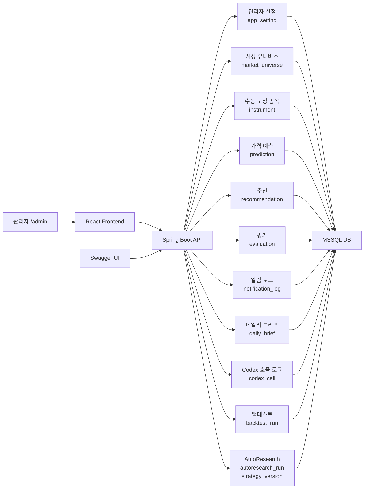

### 설명

| 영역 | 역할 |
|---|---|
| React Frontend | 관리자 화면과 사용자 화면을 제공한다. 직접 로직을 처리하지 않고 API만 호출한다. |
| Swagger UI | API 테스트와 요청/응답 형식 확인에 사용한다. |
| Spring Boot API | 모든 비즈니스 로직과 DB 저장/조회 흐름을 담당한다. |
| MSSQL DB | 설정, 종목, 추천, 평가, 로그, AutoResearch 결과를 저장한다. |

## 2. 관리자 설정 흐름

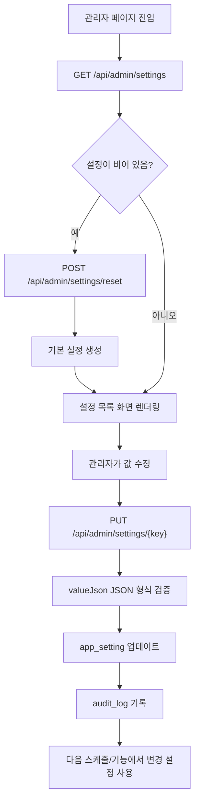

### 핵심 포인트

| 단계 | 설명 |
|---|---|
| 설정 조회 | 프론트는 먼저 `/api/admin/settings`를 호출해 설정 화면을 구성한다. |
| 기본값 생성 | 최초 실행 시 `/api/admin/settings/reset`을 호출하면 기본 설정이 생성된다. |
| 설정 저장 | 개별 설정은 `key` 단위로 수정한다. |
| 감사 로그 | 모든 설정 변경은 `audit_log`에 남긴다. |

## 3. 시장 데이터 수집부터 추천 생성까지 흐름

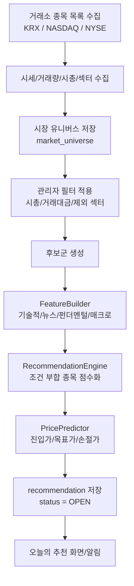

### 핵심 포인트

| 규칙 | 설명 |
|---|---|
| 수동 등록 불필요 | 최종 플로우는 사용자가 종목을 직접 등록하지 않고 시장 데이터를 수집해 후보군을 만든다. |
| 종목 관리 화면의 역할 | `instrument`는 개발용 seed 또는 수동 보정용으로만 사용한다. |
| 후보군 필터 | 시총, 거래대금, 가격, 섹터, 제외 종목 조건으로 추천 대상 universe를 줄인다. |
| 추천 상태 기본값 | 추천 생성 시 상태는 항상 `OPEN`으로 저장된다. |
| 기간 구분 | `term`은 `SHORT` 또는 `LONG`만 허용한다. |
| 추천 근거 | `signalsJson`은 유효한 JSON 문자열이어야 한다. |

## 4. 추천 평가 및 상태 변경 흐름

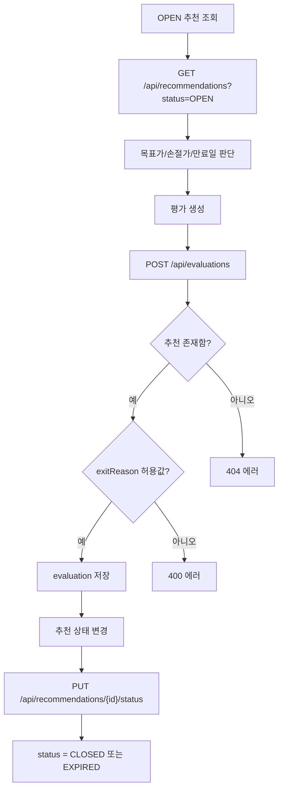

### 청산 사유

| exitReason | 의미 |
|---|---|
| TARGET_HIT | 목표가 도달 |
| STOP_HIT | 손절가 이탈 |
| TIME_OUT | 예상 매도일 만료 |
| MANUAL_CLOSE | 수동 종료 |

### 추천 상태

| status | 의미 |
|---|---|
| OPEN | 아직 진행 중인 추천 |
| CLOSED | 평가가 끝난 추천 |
| EXPIRED | 만료된 추천 |

## 5. 데일리 브리프와 Codex 호출 흐름

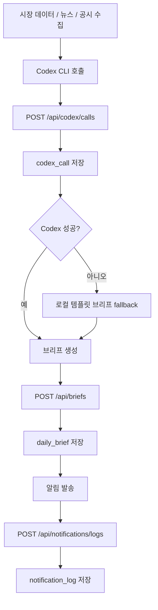

### 핵심 포인트

| 항목 | 설명 |
|---|---|
| Codex 로그 | 프롬프트 원문은 저장하지 않고 `promptHash`, `promptLen`, `durationMs`, `succeeded`를 저장한다. |
| 브리프 저장 | 최종 브리프는 Markdown 문자열로 `daily_brief.brief_md`에 저장한다. |
| 알림 로그 | Telegram/Kakao 실제 발송 결과는 `notification_log`에 저장한다. |

## 6. AutoResearch 흐름

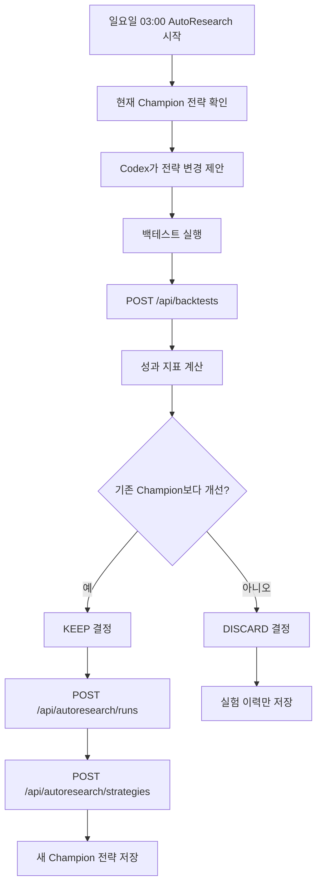

### 핵심 포인트

| 항목 | 설명 |
|---|---|
| autoresearch_run | 매 반복 실험의 결과를 저장한다. |
| strategy_version | 채택된 전략 버전과 Champion 여부를 저장한다. |
| backtest_run | 실험 성과 지표를 JSON 문자열로 저장한다. |
| decision | `KEEP`, `DISCARD`, `ERROR` 값을 권장한다. |

## 7. 스케줄 기준 운영 흐름

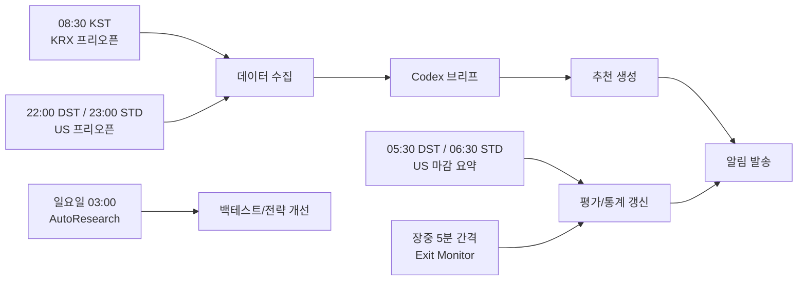

### 설명

| 스케줄 | 주요 처리 |
|---|---|
| KRX 프리오픈 | 한국장 추천, 글로벌 전일 요약, Telegram 알림 |
| US 프리오픈 | 미국장 추천, 프리마켓 동향, Telegram 알림 |
| US 마감 요약 | 보유/추천 결과 평가, 마감 브리프 |
| Exit Monitor | 목표가/손절가/만료일 감지와 평가 생성 |
| AutoResearch | 전략 자동 실험, 백테스트, Champion 갱신 |

## 8. 프론트 화면별 데이터 흐름

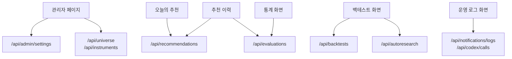

### 화면별 설명

| 화면 | 사용하는 API | 설명 |
|---|---|---|
| 관리자 페이지 | 설정, 유니버스/종목 API | 런타임 설정과 자동 후보군, 수동 보정 종목을 관리한다. |
| 오늘의 추천 | 추천 API | `OPEN` 상태 추천을 보여준다. |
| 추천 이력 | 추천, 평가 API | 과거 추천과 실제 결과를 함께 보여준다. |
| 통계 화면 | 평가 API | Hit Rate, ROI, MDD 같은 지표의 원천 데이터를 조회한다. |
| 백테스트 화면 | 백테스트, AutoResearch API | 전략 검증 결과와 챔피언 전략을 보여준다. |
| 운영 로그 화면 | 알림 로그, Codex 로그 API | 알림 실패와 LLM 호출 상태를 확인한다. |

## 9. 현재 구현과 이후 구현 구분

### 현재 구현된 것

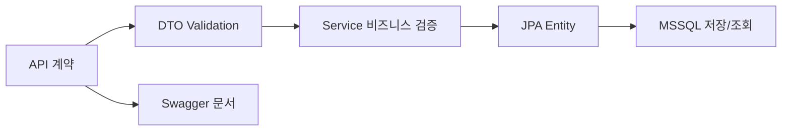

### 이후 붙일 것

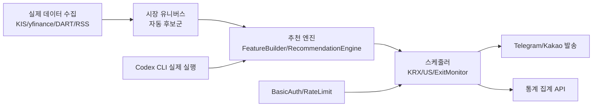

## 10. 최소 테스트 흐름

Swagger에서 직접 테스트할 때는 아래 순서가 가장 단순하다.

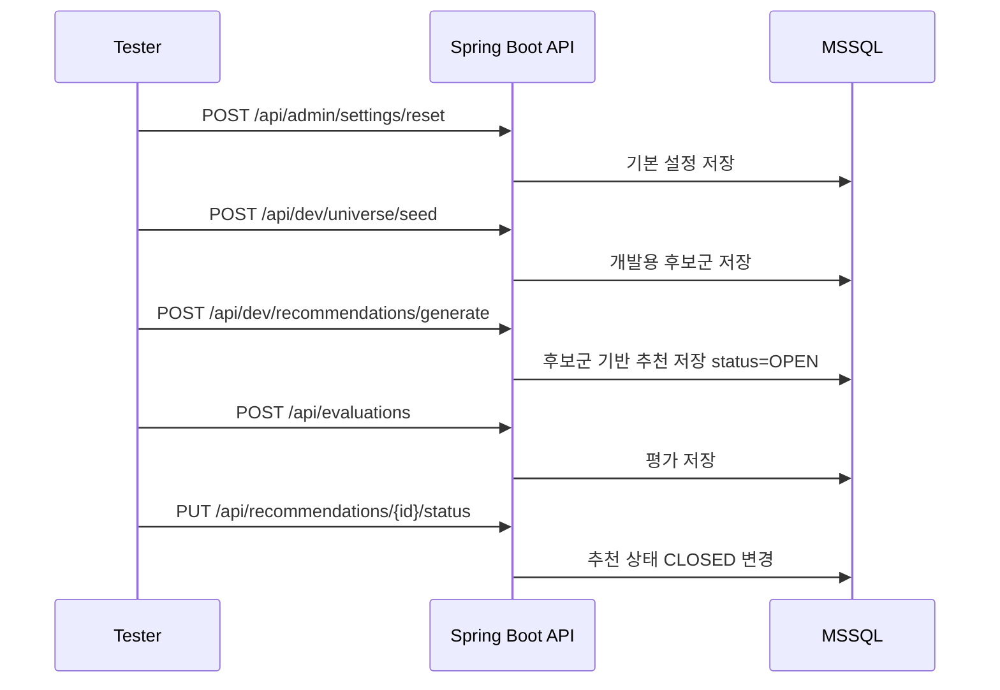

### 테스트 순서

| 순서 | API | 결과 |
|---:|---|---|
| 1 | `POST /api/admin/settings/reset` | 기본 관리자 설정 생성 |
| 2 | `POST /api/dev/universe/seed` | 실제 수집 전 개발용 후보군 저장 |
| 3 | `POST /api/dev/recommendations/generate` | 후보군 기반 추천 저장 |
| 4 | `GET /api/recommendations?status=OPEN` | 추천 조회 |
| 5 | `POST /api/evaluations` | 추천 결과 평가 저장 |
| 6 | `PUT /api/recommendations/{id}/status` | 추천 상태 종료 처리 |

## 11. 개발용 자동 생성 흐름

실제 데이터 수집과 추천 엔진이 붙기 전에는 개발용 후보군/자동 생성 API로 프론트와 DB 흐름을 확인한다.

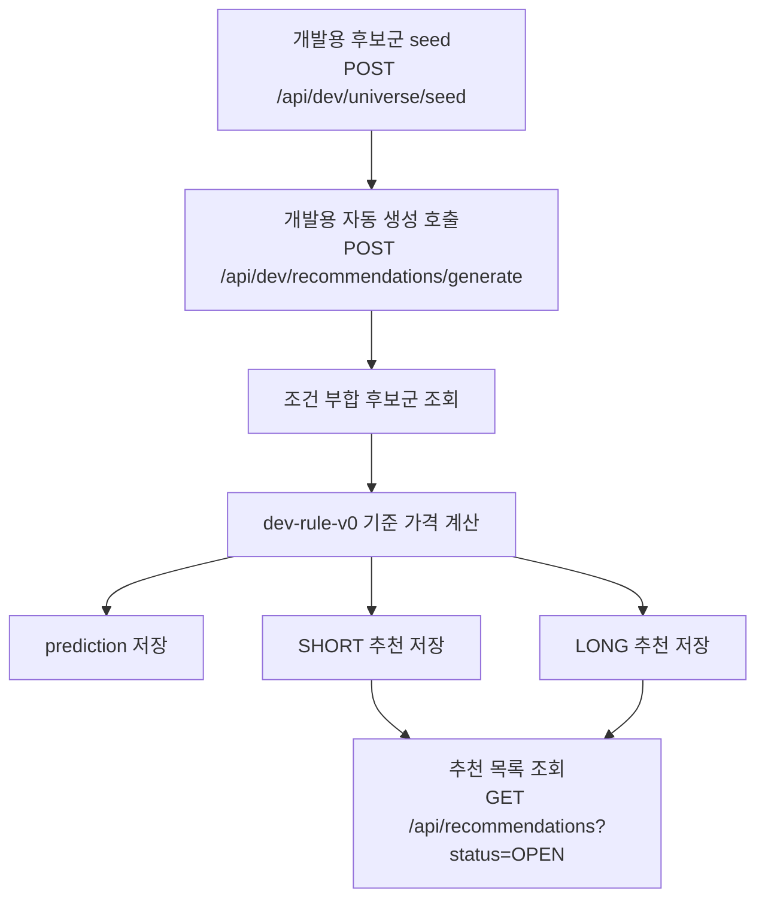

| 단계 | 설명 |
|---|---|
| 후보군 seed | 실제 수집 전에는 개발용 후보군을 임시 저장한다. |
| 자동 생성 호출 | 시장과 단기/장기 개수를 지정할 수 있다. |
| 예측 저장 | 각 후보 종목마다 개발용 예측 가격을 저장한다. |
| 추천 저장 | 단기/장기 추천을 `OPEN` 상태로 저장한다. |
| 추천 조회 | 프론트는 OPEN 추천을 조회해서 오늘의 추천 화면을 구성한다. |
